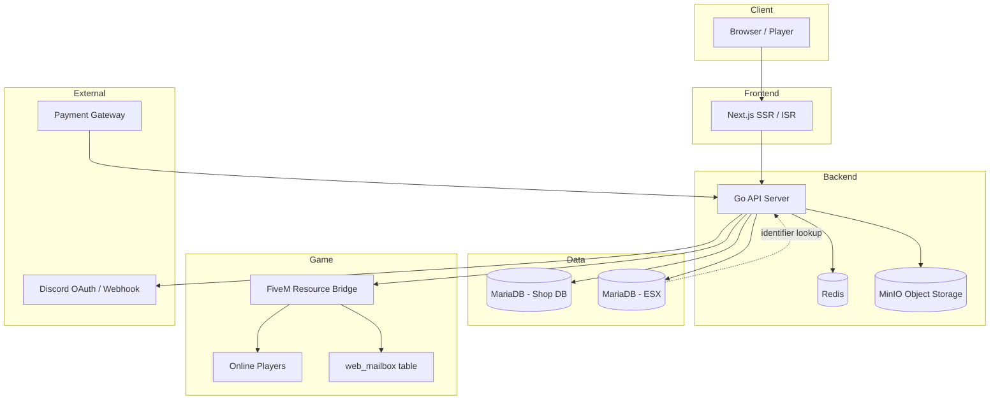

# Raven Webmarket

Enterprise-grade FiveM ESX web shop system with Discord OAuth, dual milestone/redeem accumulation, payment webhooks, slip storage, admin backoffice, and real-time in-game delivery.

**Cross-platform:** runs on **Windows** and **Linux** (native dev or Docker).

---

## Documentation Index

| Document | Purpose | Audience |
|----------|---------|----------|
| **[README.md](./README.md)** (this file) | Architecture, features, installation, API summary | Developers & server owners |
| **[DEPLOYMENT.md](./DEPLOYMENT.md)** | Production deploy: systemd, Docker, K8s, Cloudflare, troubleshooting | DevOps / production |
| `.env.example` | All environment variables with defaults | Setup |
| `database/migrations/` | SQL schema evolution (`001`–`006`) | DB admin |
| `PROGRESS.md`, `WEBSITE.MD`, `README.th.md`, `DEPLOYMENT.th.md` | Local notes (gitignored, not in repo) | Owner only |

---

## Player Features Overview

| Feature | Path | Login | Description |
|---------|------|-------|-------------|
| Home & catalog | `/` | No | Banners, featured products, announcements |
| Shop | `/shop` | No (buy: Yes) | Products + **Packs & Bundles** tabs, search & filters |
| **Shopping cart** | `/cart` | Yes | Multi-item cart, quantity, checkout |
| Top-up | API `/api/v1/payments/*` | Yes | Create payment, upload slip, earn points |
| Milestones | `/milestones` | Yes | Monthly accumulation tiers — claim rewards |
| Redeem | `/redeem` | Yes | Spend redeem points on catalog items |
| Forum | `/forum` | Post: Yes | Community threads |
| Announcements | `/announcements` | No | Official notices (EN/TH) |
| News | `/news` | No | Daily updates / patch notes |

---

## Shopping Cart System

The cart is stored in **Redis DB `REDIS_CART_DB`** (default index `1`), keyed by Discord ID. It persists until checkout or manual clear.

### Flow

1. Player logs in via Discord OAuth (must exist in ESX with linked `discord_id`).
2. Adds **products** (`type: product`) or **packs** (`type: package`) from `/shop`.
3. Opens `/cart` — view items, quantities, and total.
4. Clicks **Checkout** → `POST /api/v1/orders/checkout`.
5. API validates stock, expiry, `max_limit_per_id`, applies Redis lock + `SELECT FOR UPDATE`.
6. Items delivered to FiveM (online) or `web_mailbox` (offline); cart cleared on success.

### Cart API (auth required)

| Method | Path | Description |
|--------|------|-------------|
| GET | `/api/v1/cart` | Get current cart + total |
| POST | `/api/v1/cart/items` | Add item `{ type, id, name, quantity, price }` |
| PUT | `/api/v1/cart/items` | Update quantity `{ type, id, quantity }` |
| DELETE | `/api/v1/cart/items` | Remove item `{ type, id }` |

### Purchase limits

Set **`max_limit_per_id = 1`** on a product or pack in Admin → **Shop & CMS → Products/Packs** to enforce **one purchase per Discord ID**. Global stock uses `stock_limit`.

---

## Top-up & Minimum Amount

Players top up via payment gateway or manual slip flow. Completed top-ups:

- Increase **monthly_accumulation** (milestone tiers, non-decreasing until monthly reset)
- Increase **redeem_points** (`REDEEM_POINTS_PER_BAHT` × amount)
- Log to `topup_transactions` with optional slip image in MinIO

### Minimum top-up

| Setting | Location | Default |
|---------|----------|---------|
| `MIN_TOPUP_AMOUNT` | `.env` | `50` (THB) |
| Admin override | `PUT /api/v1/admin/payment-settings` | Stored in `system_settings.payment_settings` |
| Public read | `GET /api/v1/payments/settings` | Returns `min_topup_amount`, `redeem_points_per_baht` |

Requests below the minimum are rejected on `POST /api/v1/payments/create` and payment webhooks.

### Top-up API

| Method | Path | Auth | Description |
|--------|------|------|-------------|
| GET | `/api/v1/payments/settings` | No | Min top-up & points rate |
| POST | `/api/v1/payments/create` | Yes | Start pending top-up |
| POST | `/api/v1/payments/slip` | Yes | Upload slip image (base64) |
| GET | `/api/v1/payments/history` | Yes | Player top-up history |
| POST | `/api/v1/payments/webhook` | No | Gateway callback (HMAC) |

---

## Admin Backoffice

Login: **`/admin/login`** (username/password — not Discord).

### Shop & CMS (`/admin/cms`)

| Tab | Manage |
|-----|--------|
| **Products** | SKU, name, ESX item/qty, image URL, regular/sale price, sale start & expiry, stock, `max_limit_per_id`, featured |
| **Packs** | Bundle SKU, multiple ESX items + quantities, pricing, limits, schedule |
| **Promotions** | Campaign name, target product/pack, sale window, banner image |
| **Milestones** | Monthly event + tiers (threshold → reward item) |
| **Redeem** | Point-cost catalog items |
| **Banners** | Homepage slider |
| **News/Ads** | Announcements, ads, daily updates (EN/TH) |

### Other admin pages

| Path | Purpose |
|------|---------|
| `/admin` | KPI dashboard, monthly reset buttons |
| `/admin/users` | Search players, top-up history, slip viewer |
| `/admin/purchases` | Order / checkout logs |
| `/admin/kpi` | Revenue, peak, top spenders |
| `/admin/security` | Admin accounts + **per-user permissions** (dev_admin) |
| `/admin/autoscale` | Kubernetes HPA tuning (dev_admin) |
| `/admin/monitoring` | Health check (DB, Redis, MongoDB) |

### Granular admin permissions

`dev_admin` can assign custom permission lists per `admin` account (e.g. CMS-only, no KPI). Permissions include: `products`, `packages`, `promotions`, `milestones`, `redeem`, `users`, `kpi`, `reset_monthly`, etc. See `GET /api/v1/admin/permissions`.

### Monthly accumulation reset

- **Automatic:** 1st of each month at 17:00 UTC (configurable in `system_settings.monthly_reset`)
- **Manual:** Admin dashboard → **Reset Monthly Accumulation** (redeem points kept)
- **Full reset:** dev_admin → **Reset All (+ Redeem Points)**

---

## Database Migrations

Run with `bash scripts/migrate.sh` or `.\scripts\migrate.ps1`:

| File | Contents |
|------|----------|
| `001_init.sql` | Core shop schema: products, packs, orders, cart counts, milestones, redeem, top-ups |
| `002_admin_rbac.sql` | Admin accounts, audit/activity logs, system settings |
| `003_cms_content.sql` | Site posts, forum seed, sample content |
| `004_autoscale_i9_profile.sql` | HPA defaults for i9 / 64 GB host |
| `005_shop_admin_features.sql` | Promotions table, sale dates, admin permissions JSON, monthly reset config |
| `006_payment_settings.sql` | Default min top-up (50 THB) in system settings |

---

## Architecture



### Component Overview

| Layer | Technology | Responsibility |
|-------|------------|----------------|
| Frontend | Next.js 14 (SSR/ISR) | Landing page, shop, cart, milestones, redeem, admin UI |
| API | Go (Chi router) | REST API, auth, business logic, webhooks |
| Cache | Redis (3 logical DBs) | Sessions, cart, rate limiting, catalog cache |
| Shop DB | MariaDB | Products, orders, milestones, redeem, top-ups, audit logs |
| ESX DB | MariaDB (read-only) | Match Discord OAuth ID → `users.discord_id` (`discord:…`) → steam `identifier` |
| MongoDB (optional) | MongoDB 7 | Optional side store — set `MONGO_ENABLED=true`; not required for core shop flow |

### Discord Login Rules

1. Player logs in with Discord OAuth; the API builds `discord:{numeric_id}` (example: `discord:1026591865648185426`).
2. The API queries ESX `users` where `discord_id = discord:{id}` (falls back to `discord` column if present).
3. If no row is found, login is **denied** — the player must exist in the ESX database with a linked Discord ID.
4. The matched `identifier` must be a **Steam hex** value (`steam:110000xxxxxxxx`). Accounts whose `identifier` is a Discord ID are **rejected**.

| Storage | MinIO | Payment slip images (`slip_url` in DB) |
| Game Bridge | FiveM Lua resource | Online delivery + offline mailbox |
| Orchestration | Kubernetes + HPA | Auto-scale API/frontend at 55% CPU / 65% RAM (tuned profile below) |

### Redis Index Layout

| DB Index | Purpose |
|----------|---------|
| `REDIS_SESSION_DB` (0) | JWT sessions, catalog cache |
| `REDIS_CART_DB` (1) | Per-user shopping carts |
| `REDIS_RATELIMIT_DB` (2) | API rate limiting / anti-spam |

### Dual Accumulation System

1. **Monthly Milestone (non-decreasing):** Top-up amounts accumulate for the current month. Claiming tier rewards does not reduce the total. One claim per tier per Discord ID per event.
2. **Redeem Points (decreasing):** Separate points earned from top-ups. Redeeming an item deducts points immediately.

### Security

- Redis distributed locks on checkout, redeem, and payment webhooks
- `SELECT FOR UPDATE` on stock and point balances
- Automatic rollback on failed FiveM delivery
- Admin audit logs for all backoffice actions
- Rate limiting at Redis layer before MariaDB
- Security response headers on API and Next.js
- Cloudflare-aware client IP (`TRUST_CLOUDFLARE`, `TRUSTED_PROXIES`)
- Payment webhook HMAC signature verification
- Game mailbox API requires `FIVEM_API_KEY` or `FIVEM_WEBHOOK_SECRET`
- Payment webhook rejected in production if `PAYMENT_WEBHOOK_SECRET` is empty

### Security Hardening Checklist (Production)

| Risk | Mitigation | Status |
|------|------------|--------|
| Race condition on checkout/redeem | Redis lock + `SELECT FOR UPDATE` | Built-in |
| Fake payment webhooks | Set `PAYMENT_WEBHOOK_SECRET` + HMAC header | **Required in production** |
| Mailbox item theft via HTTP API | Set `FIVEM_API_KEY` on game bridge calls | **Required if endpoints exposed** |
| OAuth CSRF | Use Cloudflare rate limit on `/api/v1/auth/*` | Configure in Cloudflare |
| Admin brute force | Change default passwords; Cloudflare rate limit `/admin/login` | **Change passwords immediately** |
| DDoS / API spam | Redis rate limit + Cloudflare WAF + Bot Fight | Enable both layers |
| Wrong client IP (ban bypass) | `TRUST_CLOUDFLARE=true` behind Cloudflare | Set in `.env` |
| Default JWT/session secrets | Long random `JWT_SECRET` / `SESSION_SECRET` | Never use `.env.example` defaults |
| Public metrics scraping | Restrict `/metrics` at reverse proxy or firewall | Recommended |
| SQL injection | Parameterized queries throughout Go services | Built-in |
| XSS on frontend | Security headers + React escaping | Built-in; add CSP at proxy if needed |

See **[DEPLOYMENT.md](./DEPLOYMENT.md#cloudflare-security-setup)** for Cloudflare WAF rules.

### Admin Backoffice (Separate Login)

Admin access uses **username/password** at `/admin/login` — **not** Discord OAuth.

| Role | Access |
|------|--------|
| `admin` | Custom permissions (default: CMS, products, KPI, …) |
| `dev_admin` | Full access + security, autoscale, account management |

Default accounts are created by migration `002_admin_rbac.sql`. **Change passwords immediately in production.**

See [DEPLOYMENT.md](./DEPLOYMENT.md) for full admin role documentation and production setup without keeping a terminal open.

### Health & Monitoring

| Endpoint | Purpose |
|----------|---------|
| `GET /healthz` | Kubernetes liveness/readiness |
| `GET /metrics` | Prometheus metrics |

---

## Prerequisites

| Tool | Windows | Linux |
|------|---------|-------|
| Go 1.22+ | [go.dev/dl](https://go.dev/dl/) | `sudo apt install golang` or official tarball |
| Node.js 20+ | [nodejs.org](https://nodejs.org/) | `nvm install 20` or package manager |
| MariaDB 11+ | Installer or Docker | `apt install mariadb-server` or Docker |
| Redis 7+ | Docker or WSL | `apt install redis-server` or Docker |
| Docker (optional) | Docker Desktop | Docker Engine |
| Git | Git for Windows | `apt install git` |

---

## Installation

### 1. Clone Repository

```bash
git clone https://github.com/raven-clown/raven-webmarket.git
cd raven-webmarket
```

### 2. Environment Configuration

```bash
cp .env.example .env
```

Edit `.env` with your values. Key variables:

| Variable | Description |
|----------|-------------|
| `DISCORD_CLIENT_ID` / `DISCORD_CLIENT_SECRET` | Discord OAuth2 app credentials |
| `DISCORD_REDIRECT_URI` | Must match Discord app redirect (e.g. `http://localhost:8080/api/v1/auth/callback`) |
| `DISCORD_ADMIN_IDS` | Comma-separated Discord user IDs with admin access |
| `DISCORD_WEBHOOK_URL` | Admin payment notification webhook |
| `DB_*` | Shop MariaDB connection |
| `ESX_DB_*` | ESX MariaDB connection (identifier lookup) |
| `REDIS_*` | Redis host and logical DB indexes |
| `MINIO_*` | Slip image object storage |
| `FIVEM_WEBHOOK_URL` | FiveM HTTP handler URL |
| `FIVEM_WEBHOOK_SECRET` | Shared secret with FiveM resource |
| `REDEEM_POINTS_PER_BAHT` | Points earned per 1 THB top-up (default `1`) |
| `MIN_TOPUP_AMOUNT` | Minimum top-up in THB (default `50`; overridable in admin) |
| `SESSION_SECRET` / `JWT_SECRET` | Random strings for production |
| `NEXT_PUBLIC_API_URL` | Frontend → API URL |

### 3. Database Migration

**Linux / macOS / Git Bash:**

```bash
bash scripts/migrate.sh
```

**Windows PowerShell:**

```powershell
.\scripts\migrate.ps1
```

Requires `mysql` CLI in PATH.

### 4. Start Infrastructure (Docker)

Works identically on Windows and Linux:

```bash
docker compose -f deploy/docker-compose.yml up -d mariadb redis minio
```

### 5. Run Backend

**Linux:**

```bash
cd backend
go mod download
go run ./cmd/server
```

**Windows PowerShell:**

```powershell
cd backend
go mod download
go run ./cmd/server
```

### 6. Run Frontend

**Both platforms:**

```bash
cd frontend
npm install
npm run dev
```

Open `http://localhost:3000`

### 7. One-Command Dev (Optional)

**Linux:**

```bash
bash scripts/dev.sh
```

**Windows:**

```powershell
.\scripts\dev.ps1
```

---

## Docker Full Stack

```bash
cp .env.example .env
docker compose -f deploy/docker-compose.yml up -d --build
bash scripts/migrate.sh
```

Services:

| Service | Port |
|---------|------|
| Frontend | 3000 |
| API | 8080 |
| MariaDB | 3306 |
| Redis | 6379 |
| MinIO | 9000 (API), 9001 (Console) |

---

## Reference Hardware Profile (Autoscale Baseline)

Values below are pre-tuned for the **owner's production host**. Adjust min/max replicas and pod limits if your server differs.

| Component | Owner spec | Notes |
|-----------|------------|-------|
| CPU | Intel Core **i9 14th Gen** (e.g. i9-14900K, ~24C/32T) | Go API scales horizontally via HPA |
| RAM | **64 GB** | Headroom for MariaDB, Redis, MinIO + many pods |
| GPU | **NVIDIA GeForce GTX 770** | Not used by shop/API; optional for local dev/build |
| OS | Windows 10/11 or Linux | Docker Compose or k3s both supported |

### Pre-configured HPA (Kubernetes)

Applied in `deploy/kubernetes/hpa-*.yaml`, admin defaults, and migration `004_autoscale_i9_profile.sql`:

| Target | Min pods | Max pods | CPU target | Memory target | Pod limits (per pod) |
|--------|----------|----------|------------|---------------|----------------------|
| **API** | 3 | 16 | 55% | 65% | 1.5 CPU / 1 GiB RAM |
| **Frontend** | 2 | 12 | 55% | 65% | 1 CPU / 768 MiB RAM |

**Why these numbers:** On 64 GB RAM, max theoretical load (~16 API + 12 frontend pods) stays under ~28 GB for app containers, leaving ~36 GB for OS, MariaDB, Redis, MinIO, and burst.

### Adjust for your hardware

| Your RAM | Suggested API max | Suggested Frontend max | DB pool (`DB_MAX_OPEN`) |
|----------|-------------------|------------------------|-------------------------|
| 16 GB | 6 | 4 | 30 |
| 32 GB | 10 | 8 | 50 |
| **64 GB (owner)** | **16** | **12** | **80** |
| 128 GB+ | 24 | 16 | 120 |

1. Edit HPA YAML or use Admin → **Pod Autoscale** (`/admin/autoscale`) as `dev_admin`
2. Run `bash scripts/migrate.sh` (applies `004_autoscale_i9_profile.sql` to DB settings)
3. Apply: `kubectl apply -f deploy/kubernetes/hpa-api.yaml -f deploy/kubernetes/hpa-frontend.yaml`

### Performance `.env` tuning (64 GB profile)

```env
DB_MAX_OPEN=80
DB_MAX_IDLE=20
RATE_LIMIT_REQUESTS=120
APP_ENV=production
TRUST_CLOUDFLARE=true
PAYMENT_WEBHOOK_SECRET=<long-random-secret>
FIVEM_API_KEY=<long-random-secret>
```

---

## Kubernetes Deployment & HPA Autoscale

HPA scales API and Frontend pods when CPU exceeds **55%** or memory exceeds **65%** (owner profile).

### Quick apply

**Linux / Git Bash:**

```bash
bash scripts/k8s-apply.sh
```

**Windows:**

```powershell
.\scripts\k8s-apply.ps1
```

**Manual:**

```bash
kubectl apply -k deploy/kubernetes/
kubectl create secret generic raven-env --from-env-file=.env -n raven-webmarket
```

### Manifests

| File | Purpose |
|------|---------|
| `deploy/kubernetes/kustomization.yaml` | Apply all resources |
| `deploy/kubernetes/hpa-api.yaml` | API HorizontalPodAutoscaler |
| `deploy/kubernetes/hpa-frontend.yaml` | Frontend HPA |
| `deploy/kubernetes/api-deployment.yaml` | API Deployment + Service + probes |
| `deploy/kubernetes/frontend-deployment.yaml` | Frontend Deployment + Service |
| `deploy/kubernetes/servicemonitor.yaml` | Prometheus `/metrics` |

**Requires metrics-server** on the cluster for HPA to work.

### Admin tuning

Dev Admin → **Pod Autoscale** (`/admin/autoscale`) saves targets to DB and exports apply-ready HPA YAML.

Full guide: **[DEPLOYMENT.md](./DEPLOYMENT.md#kubernetes--hpa-autoscale)**

---

## FiveM Resource

1. Copy `fivem-resource/` to your server `resources/` folder
2. Add to `server.cfg`:

```
setr raven_webmarket_secret "your-secret-matching-FIVEM_WEBHOOK_SECRET"
setr raven_webmarket_api "http://your-api-host:8080"
ensure raven-webmarket-bridge
```

3. Ensure `web_mailbox` table exists (created by shop migration)

**Online players:** items delivered instantly with notification.  
**Offline players:** items queued in `web_mailbox`, claimed on next login.

---

## API Overview

| Method | Path | Auth | Description |
|--------|------|------|-------------|
| GET | `/healthz` | No | Health check |
| GET | `/metrics` | No | Prometheus metrics |
| GET | `/api/v1/catalog/banners` | No | Homepage banners |
| GET | `/api/v1/catalog/categories` | No | Product categories |
| GET | `/api/v1/catalog/products` | No | Products (cached, respects expiry) |
| GET | `/api/v1/catalog/packages` | No | Packs / bundles |
| GET | `/api/v1/catalog/promotions` | No | Active promotion campaigns |
| GET | `/api/v1/content/posts` | No | Announcements, ads, daily updates |
| GET | `/api/v1/forum/threads` | No | Forum thread list |
| POST | `/api/v1/forum/threads` | Yes | Create forum thread |
| GET | `/api/v1/payments/settings` | No | Min top-up & points rate |
| GET | `/api/v1/auth/discord` | No | Start Discord OAuth |
| GET | `/api/v1/auth/callback` | No | OAuth callback |
| GET | `/api/v1/auth/me` | Yes | Current user profile |
| GET | `/api/v1/cart` | Yes | Get cart |
| POST | `/api/v1/cart/items` | Yes | Add to cart |
| PUT | `/api/v1/cart/items` | Yes | Update quantity |
| DELETE | `/api/v1/cart/items` | Yes | Remove item |
| POST | `/api/v1/orders/checkout` | Yes | Purchase with locks |
| GET | `/api/v1/milestones` | Yes | Monthly tiers + accumulation |
| POST | `/api/v1/milestones/claim` | Yes | Claim tier reward |
| GET | `/api/v1/redeem/catalog` | Yes | Redeem shop |
| POST | `/api/v1/redeem` | Yes | Redeem item |
| POST | `/api/v1/payments/create` | Yes | Start top-up (min amount enforced) |
| POST | `/api/v1/payments/slip` | Yes | Upload payment slip |
| GET | `/api/v1/payments/history` | Yes | Top-up history |
| POST | `/api/v1/payments/webhook` | No | Payment gateway callback |
| GET | `/api/v1/admin/*` | Admin JWT | Backoffice & KPI |

---

## Project Structure

```
raven-webmarket/
├── backend/           Go API (cmd/server + internal/)
├── frontend/          Next.js shop + admin UI
├── database/          SQL migrations
├── deploy/            Docker + Kubernetes
├── fivem-resource/    In-game delivery bridge
├── scripts/           Cross-platform migrate, dev, k8s & install scripts
│   ├── migrate.sh     Linux / Git Bash
│   ├── migrate.ps1    Windows PowerShell
│   ├── k8s-apply.sh   Kubernetes + HPA deploy (Linux)
│   ├── k8s-apply.ps1 Kubernetes + HPA deploy (Windows)
│   ├── install-linux.sh   systemd production install
│   └── install-windows.ps1 Windows Service install
├── .env.example       Environment template
├── DEPLOYMENT.md      Production guide (Linux/Windows/Docker/K8s/Cloudflare)
├── README.md          This file — architecture, features, API
└── .env.example       Environment template
```

---

## Production Deployment (No CMD Window)

For 24/7 production without keeping a terminal open:

| Platform | Method | Guide |
|----------|--------|-------|
| Linux | systemd services | `sudo bash scripts/install-linux.sh` |
| Windows | Windows Service (NSSM) | `.\scripts\install-windows.ps1` (Admin) |
| Any | Docker Compose | `docker compose -f deploy/docker-compose.yml up -d --build` |
| K8s | HPA autoscale | `bash scripts/k8s-apply.sh` or `.\scripts\k8s-apply.ps1` |

Full details: **[DEPLOYMENT.md](./DEPLOYMENT.md)** — cart/checkout, top-up limits, admin CMS, K8s HPA, Cloudflare WAF, migrations, troubleshooting.

---

## License

Proprietary — Raven Clown / ESX server use.
